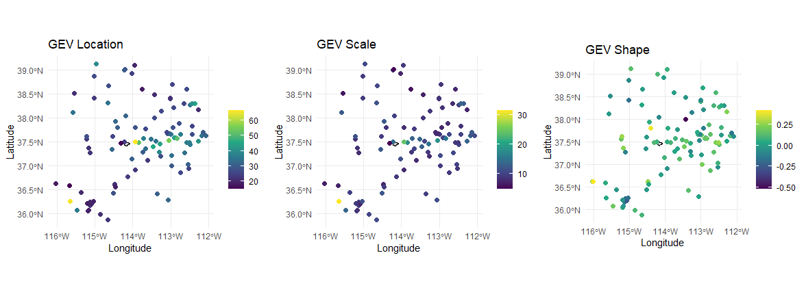
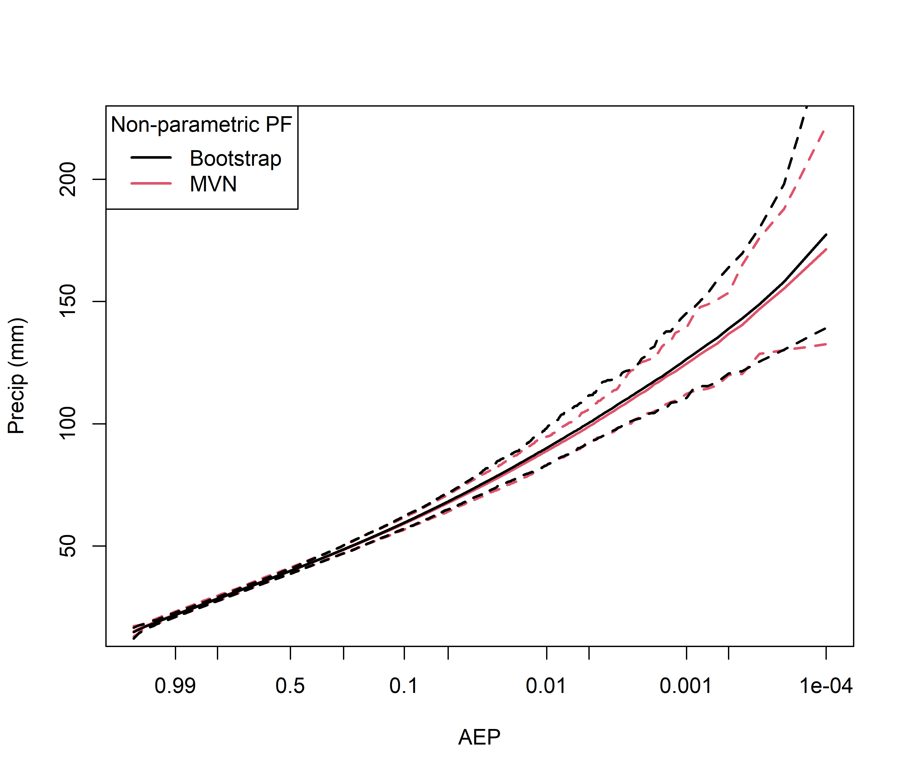
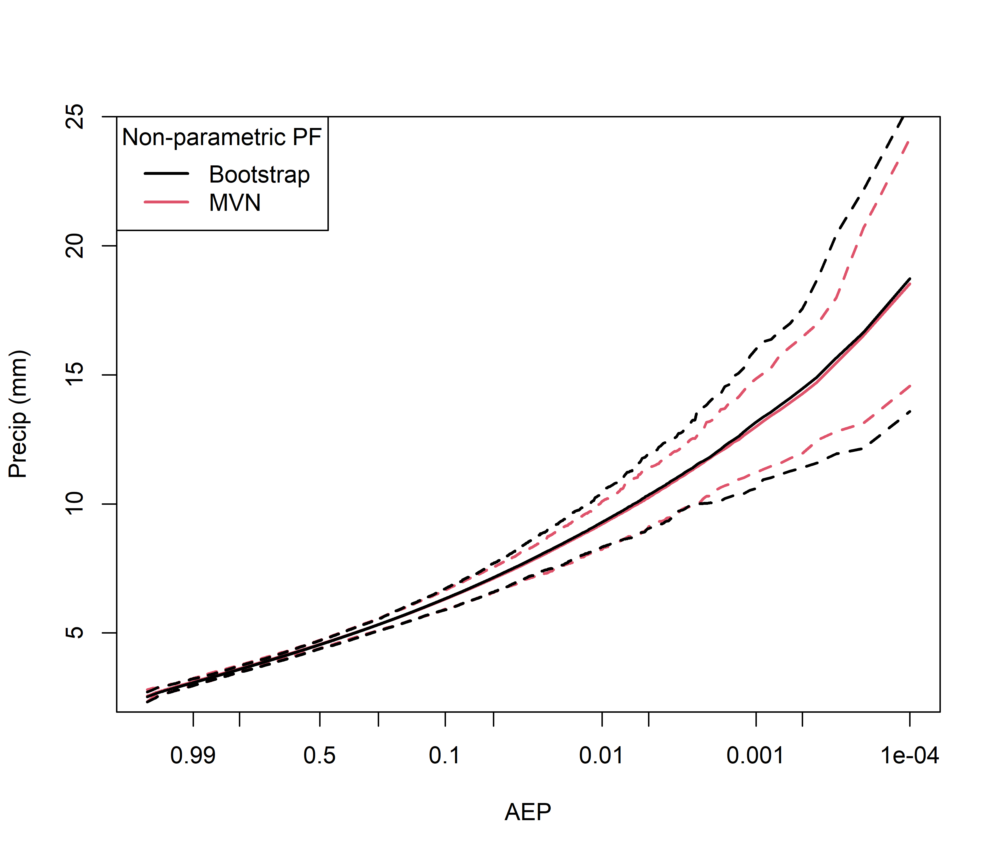
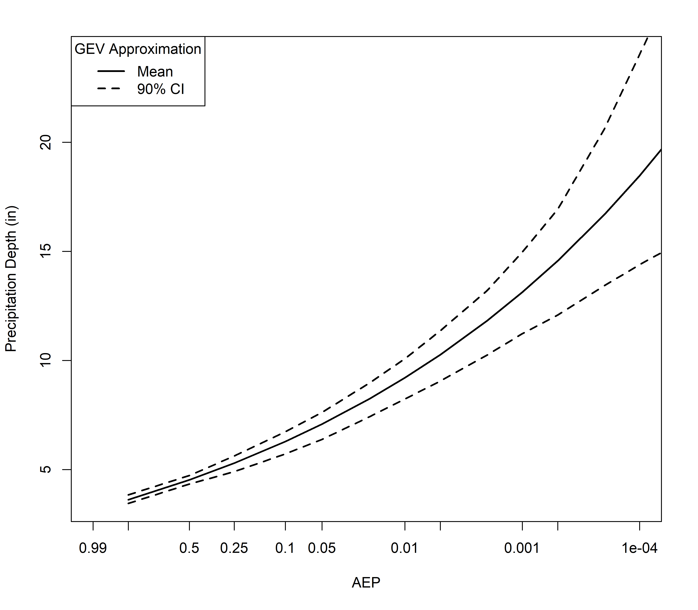
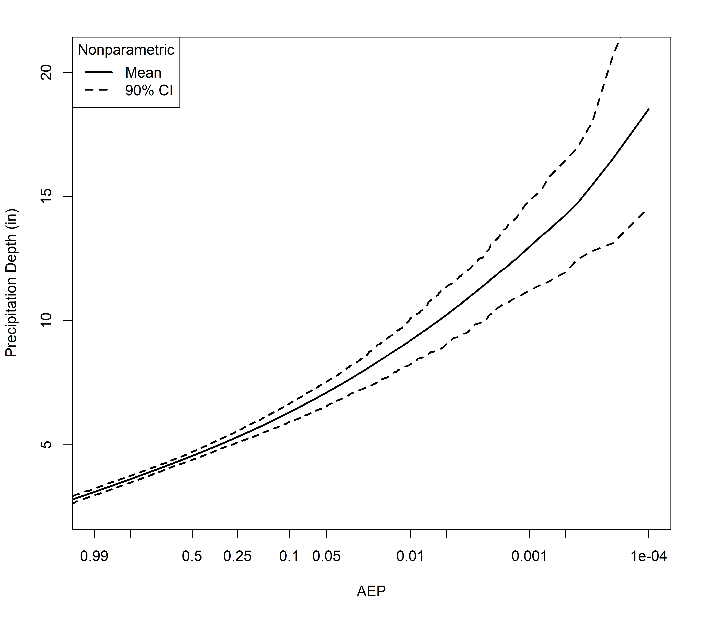
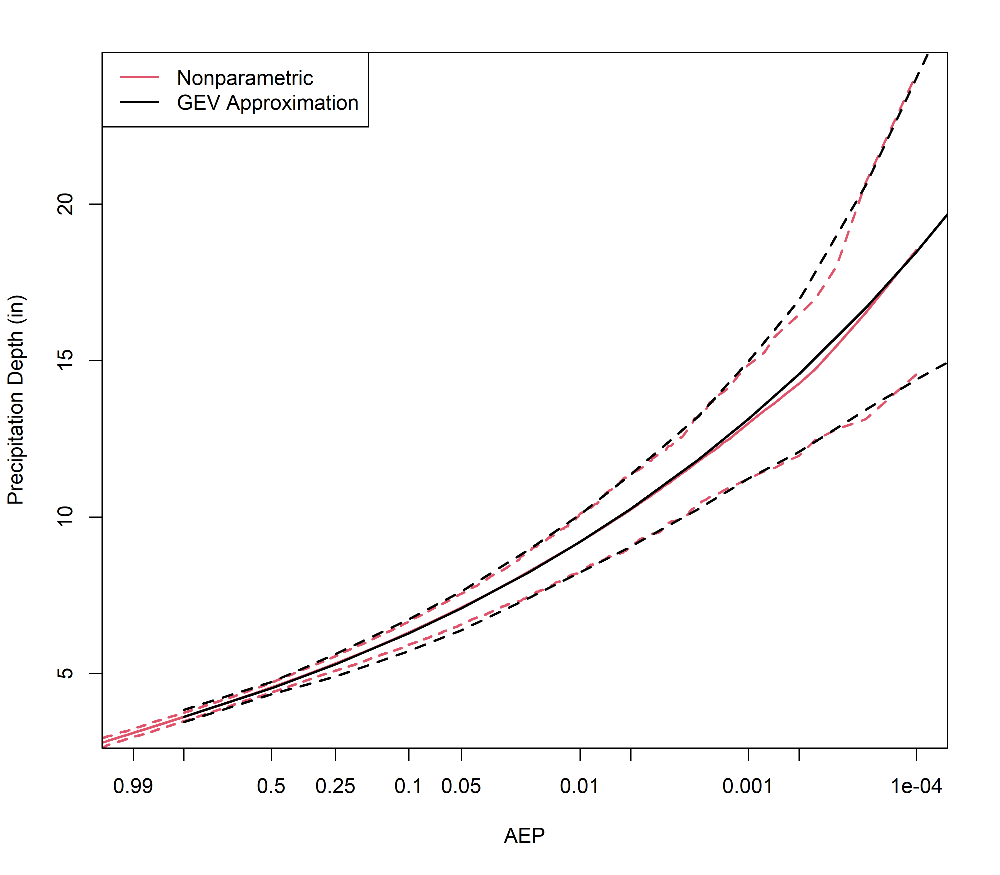
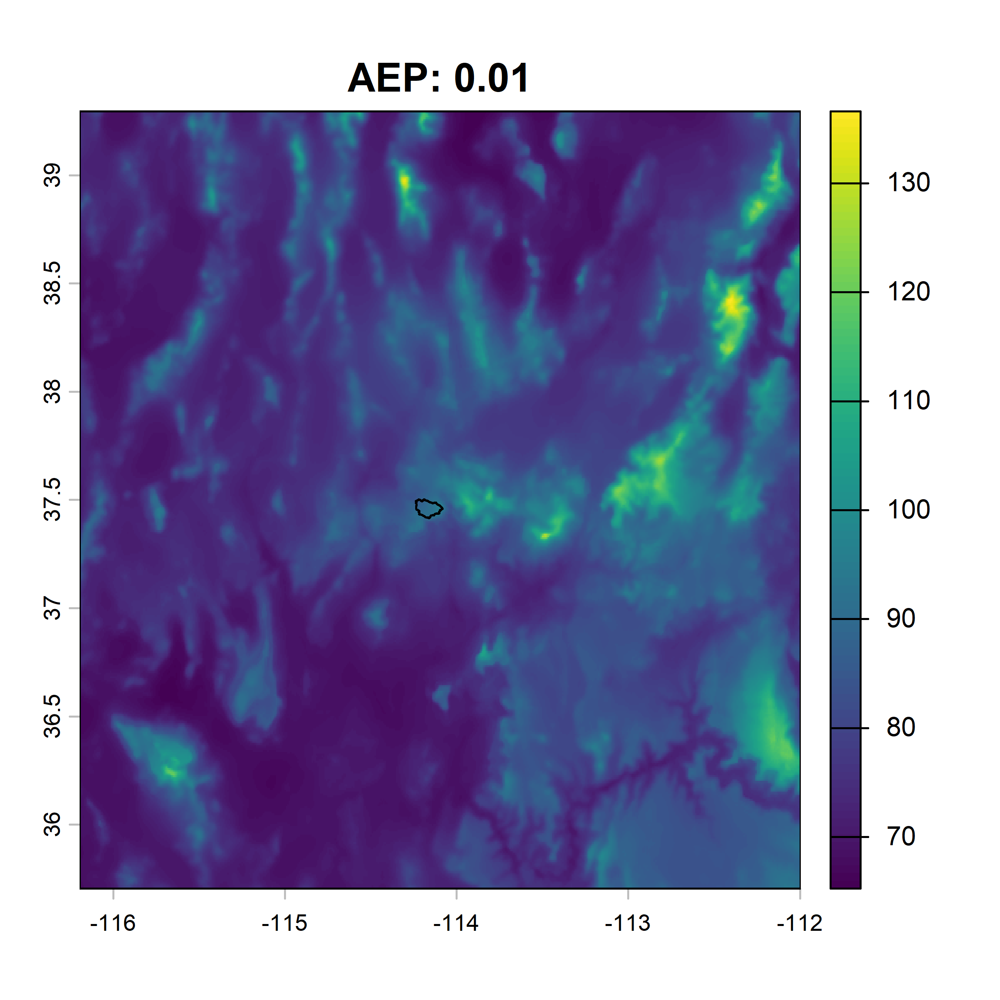

# Workflow for MSP Precipitation-Frequency {#workflow}

The following subsections describe the four-step workflow used to develop basin-average precipitation-frequency estimates with uncertainty using the RMCmsp library. 

## Step 1: `msp_setup( )` {#mspsetup}

As mentioned in the Chapter \@ref(intro), the first function was created to set up the MSP workspace. Required inputs for the `msp_setup( )` function include: 

1. `anmax`: Matrix of annual maximum precipitation. Rows are years and columns are stations. Missing values represented with `NA`. Extend the record back to the first observation at any site. 
2. `metadata`: Matrix of metadata corresponding to the annual maximum precipitation data set. Rows are stations and columns are the geostationary information. Required columns are: `"lon", "lat", "stnid"`.
3. `prism_rasters`: An RDS file containing the cropped PRISM rasters, to be used as covariates and for trend raster development, as in Section \@ref(prism). The RDS file contains the PRISM rasters of class `list`.
4. `subbasin_targets`: A matrix of coordinates in decimal degrees (longlat) defining the target locations for MSP simulation. The target locations can be subbasin centroids for very large watersheds or regularly-spaced coordinates across a smaller watershed. The formatting requirements are described in Section \@ref(targets). 
5. Optionally, `alpha` and `nfolds`, two parameters for the elastic net parameter optimization routine. Defaults are `alpha=0.95` and `nfolds=175`. If you don't know what this means, don't change them!

Now that the required inputs are sorted out, it's time to get started on the four-step workflow. Step one is using the `msp_setup( )` function to: 

- Fit GEV distributions at each station independently,
- Extract PRISM covariates for each station, 
- Optimize the PRISM covariates used as predictors in the spatial models for GEV location, scale, and shape, independently.
- Optionally, using the `plot_at_site_gev( )` function to visualize the spatial distribution of GEV parameters. This is useful for troubleshooting any sites that may have wildly inconsistent parameters. Based on Figure \@ref(fig:atsite), do you see any sites that might be worth investigating? (Note the watershed is very small in this example - you can see it in the center of the GEV plots).

```{r eval=FALSE}
library(devtools)
load_all()

msp_workspace <- msp_setup(anmax=mc_anmax, metadata=mc_meta, prism_rasters=mc_prism, subbasin_targets=mc_targets)
plot_at_site_gev(at_site_gev = msp_workspace$gev.fits, shp=mc_shapefile)

```

```{r atsite, out.width='99%', fig.asp=.75, fig.align='center', fig.cap="Plot of GEV location (left), scale (middle), and shape (right) for all sites in MSP analysis.", echo=FALSE}

```

Note that the input data are baked into the R package, so when you install the package you get the data. 
It's lazy loaded data, which means it doesn't show up in your environment until you use it. 

The `msp_setup( )` function returns a list with 12 items:

1. `anmax`: the annual maximum series for your project
2. `gev.fits`: the fitted GEV distribution parameters for each site
3. `covar_normalized`: a matrix of PRISM variables, normalized so each has mean and standard deviation of zero and one, respectively
4. `covar_colmean`: a vector of column means used to normalize the PRISM variables, used for transforming the full PRISM grids
5. `covar_colstd`: a vector of column standard deviations used to normalize the PRISM variables, used for transforming the full PRISM grids
6. `targets_normalized`: normalized coordinates for subbasin target locations
7. `glmnet_cvfit_loc`: model coefficients for the optimized GEV location model
8. `glmnet_cvfit_scale`: model coefficients for the optimized GEV scale model
9. `glmnet_cvfit_shape`: model coefficients for the optimized GEV shape model
10. `prism_rasters`: cropped PRISM rasters used to develop the the trend rasters for location, scale, and shape
11. `targets_prism`: PRISM values extracted to subbasin target locations
12. `metadata`: the station metadata for your project


## Step 2: `fit_msp( )` {#fitmsp}

Your workspace is now set up with everything you need to fit the MSP model! The `fit_msp( )` function takes three input parameters, but only one is really needed to get started:

1. `msp_workspace`: The result of the `msp_setup( )` function. All the information you need to fit the MSP model is included in this one variable!
2. Optionally, `covar.mod`: This input variable defaults to 'twhitmat', which represents the Extremal-t model with a Whittle-Matern correlation function. If this doesn't make sense to you, don't change this input variable! Valid models for this variable are: `"tpowexp", "tcauchy", "twhitmat", "tbessel", "tcaugen"`
3. Optionally, `parscale.min`: This input variable represents the minimum absolute value used when constructing the parscale vector for the joint model optimizer. Prevents near-zero scales from destabilizing numerical optimization. Default is 0.01. Again, don't change it if this makes no sense to you. 

You should be able to take your MSP workspace (defined as `msp_workspace` in Step 1) and put it into the `fit_msp( )` function with success. There may be some issues if the data are not properly QC'd, the domain is not properly defined, and other issues that come from noisy spatial data. If you're getting failed joint model fits from `fit_msp( )` and you're out of ideas, bring your issues to those hydrometeorologists identified in Section \@ref(download).

```{r eval=FALSE}
msp_fit         <- fit_msp(msp_workspace=msp_workspace, covar.mod='twhitmat')
```

Some messages will print to your R console while this model runs. Depending on the size and complexity of your domain, this could take a while (I have personally seen a joint model take 30 minutes to fit). The messages help you understand the three steps that are containd within the `fit_msp( )` function: 

- `"Fitting spatial GEV model..."`: Fit the spatial model for GEV parameters (i.e., marginals)
- `"Fitting initial MSP..."`
`"User-defined covariance model: twhitmat"`: Fit the initial MSP for spatial covariance parameters
- `"Fitting general MSP model..."`: Fit the joint model (i.e., the general MSP), which estimates the marginals and covariance simultaneously.

The general MSP model is what takes the longest. Hopefully once it stops running you see the following message: `"Joint MSP model fitted successfully."`. If it fails to converge on a fitted model, you will see a detailed error message describing what went wrong. Consult those hydrometeorologists :)

Assuming your general MSP model fitted successfully, the `fit_msp( )` function returns a list with 8 items:

1. `spatial_gev`: the fitted spatial GEV model, output from the `fitspatgev( )` function, used as initial estimates for the general MSP model
2. `initial_msp`: the fitted initial MSP model, output from the `fitmaxstab( )` function, used as initial estimates for the general MSP model
3. `general_msp`: the fitted general MSP model, if the general MSP model converged successfully. `NULL` if the general MSP model did not converge successfully
4. `general_msp_status`: the status of the general MSP model, one of: `"converged", "fit_error", "matrix_error"`. `"converged"` indicates the general MSP model was successfully fitted; `"fit_error"` indicates the general MSP model did not converge; `"matrix_error"` indicates the model converged but produced an invalid hessian and/or variance covariance matrix
5. `msp_workspace`: the MSP workspace that was provided to the `fit_msp( )` function, which is the output from `msp_setup( )`
6. `loc.form`: optimized equation for GEV location trend raster development, output from the glmnet optimization
7. `scale.form`: optimized equation for GEV scale trend raster development, output from the glmnet optimization
8. `shape.form`: optimized equation for GEV shape trend raster development, output from the glmnet optimization

## Step 3: `msp_uncertainty( )` {#mspuncertainty}

Assuming the general MSP model converged and fitted successfully, you can now take the output from `fit_msp( )` and put it into the `msp_uncertainty( )` function. 

```{r eval=FALSE}
msp_uncert_mvn   <- msp_uncertainty(msp_fit=msp_fit, method="mvn", nsims=100)
```

As mentioned in the introduction, there are technically two methods to choose from when running the `msp_uncertainty( )` function. Based on testing at two very different watersheds, you should choose `method="mvn"` until you're sure you're running your final analysis. The `mvn` method uses the general MSP model fitted values and variance covariance matrix to produce random samples from a multivariate normal (i.e., mvn) distribution. The other method (`method="boot"`) will take random samples from the general MSP model and re-fit an MSP model to each. Remember how long it took to fit the general MSP model? Multiply that by 300. Or maybe only 50 because it's parallelized. Either way, it takes forever. I just ran an analysis and it took 10 hours, compared to 1 second from `mvn`. Only do it if you like waiting (or it's your final analysis).  Here are validation figures from those two watersheds:

```{r mccomp, out.width='99%', fig.asp=.75, fig.align='center', fig.cap="Comparison of multivariate normal and bootstrap simulation methods of uncertainty for a small semi-arid watershed. ", echo=FALSE}

```
```{r bufcomp, out.width='99%', figasp=.75, fig.align='center', fig.cap="Same as above but for a moderately sized Appalachian watershed", echo=FALSE}

```

As can be seen, there is a slight reduction in uncertainty when using `method=mvn`, which is more pronounced at larger scales and/or complex topography and orographic effects. Therefore, use `method=mvn` until you're done testing, running sensitivities, alternate study regions, etc. When you're finalizing your report, use `method=boot`. 

The `msp_uncertainty( )` function returns a list with four items:

1. `param_samples`: matrix of the general MSP model parameters. The number of rows corresponds to `nsims` specified in the `msp_uncertainty( )` function call; the number of columns represents the number of parameters in the general MSP model
2. `uncertainty_method`: the method used to generate general MSP model parameters. Options are `mvn` or `boot`
3. `general_msp_used`: boolean indicating whether the general MSP model was used. This should always be TRUE
4. `msp_fit`: the fitted general MSP model and accompanying information provided by the `fit_msp( )` function, provided as input to `msp_uncertainty( )`

## Step 4: `simulate_from_msp( )` {#simulatefrommsp}

Now that we have the matrix of general MSP model parameters to quantify our uncertainty, we need to create the precipitation-frequency curves for each of the simulations. In this step, we take the bootstrapped MSP model parameters and generate thousands of random samples of annual maxima to produce the nonparametric basin-average precipitation-frequency curves with uncertainty! The annual maxima samples are generated at the target locations, and the basin averages are calculated using the target location weights. The number of random samples determines how rare of a precipitation-frequency estimate you will generate. In the example below, we specify `nsims=10000`, which results in precipitation-frequency estimates as rare as 1e-4 (i.e., 1/10,000).

```{r eval=FALSE}
msp_sims_mvn    <- simulate_from_msp(msp_uncertainty=msp_uncert_mvn, msp_fit=msp_fit, nsims=10000, subbasin_targets=mc_targets, target_weights=mc_weights)
```

Under the hood, we are building trend rasters for each parameter set from the `msp_uncertainty( )` output. The trend rasters are essentially interpolated GEV location, scale, and shape parameters. These GEV parameters are used to transform our simulations from the native Frechet space back into GEV space. For larger watersheds with a lot of subbasin targets, this step may take a while. The process is parallelized, though, so it's been pretty quick for my test basins.

The `simulate_from_msp( )` function returns a list with 10 items:

1. `pf_curve`: the nonparametric precipitation-frequency curves with uncertainty. Number of rows equals number of simulations in the `simulate_from_msp( )` function (e.g., `nsims=10000` in the `simulate_from_msp( )` function); number of columns is six: `"pp", "aep", "lower", "mean", "model", "upper"`. `"pp"` is the plotting position, `"aep"` is the corresponding annual exceedance probability, `"lower"` is the 5th percentile across all models (i.e., lower bound of 90% confidence interval), `"mean"` is the mean across all models, `"model"` is the precipitation-frequency curve from the original general MSP model, and `"upper"` is the 95th percentile across all models (i.e., upper bound of 90% confidence interval)
2. `sims_frech`: the raw random samples of annual maxima in Frechet space. An object of class `list` with length equal to the number of uncertainty samples (e.g., `nsims=100` in the `msp_uncertainty( )` function). Each list object is a matrix with number of rows equal to `nsims` from the `simulate_from_msp( )` function, and number of columns equal to the number of subbasin targets
3. `sims_gev`: the same simulations as `sims_frech` only converted back to GEV space
4. `mean_gev`: the raw basin average precipitation-frequency curves for each uncertainty sample
5. `target_locations`: GEV location parameters for each uncertainty sample and each target location (rows are samples, columns are subbasin targets)
6. `target_scales`: GEV scale parameters for each uncertainty sample and each target location (rows are samples, columns are subbasin targets)
7. `target_shapes`: GEV shape parameters for each uncertainty sample and each target location (rows are samples, columns are subbasin targets)
8. `general_msp_used`: boolean indicating whether the general MSP model was used. This should always be TRUE
9. `msp_uncertainty`: the output from the `msp_uncertainty( )` function that was used as input for `simulate_from_msp( )`
10. `msp_fit`: the fitted general MSP model and accompanying information provided by the `fit_msp( )` function, used as input for `simulate_from_msp( )`

## Step 5: Bonus Functions {#bonusfunctions}

### `msp_smooth( )` {#mspsmooth} 
The output from the `simulate_from_msp( )` function is a nonparametric precipitation-frequency curve, which can be problematic when using this analysis with a tool such as RRFT. RRFT does accept empirical precipitation-frequency information, but if you want to extrapolate to rarer AEPs then a GEV approximation is preferred. The `msp_smooth( )` function takes the output from the `simulate_from_msp( )` function and fits a GEV curve to each of the nonparametric precipitation-frequency curves to approximate the 90% confidence interval. The GEV parameters for the mean precipitation-frequency curve are also computed. Finally, the pseudo-ERL (pERL) is computed so you can put the mean GEV and ERL into RRFT to estimate your precipitation-frequency curve. The `msp_smooth( )` function takes the following input:

1. `msp_sims`: output from the `simulate_from_msp( )` function
2. `probs`: quantiles over which to apply the optimization routine. Default is c(0.001, 0.01, seq(0.1, 0.9, 0.1), 0.99, 0.999, 0.9999)
3. `ci`: the size of the confidence interval in percent (e.g., 90 equates to the 90% confidence interval). Default is 90

```{r eval=FALSE}
msp_smooth_mvn  <- msp_smooth(msp_sims=msp_sims_mvn)
```

The `msp_smooth( )` function returns a list with 6 items:

1. `gev.params`: a matrix with 5 columns (`gev.loc`, `gev.scale`, `gev.shape`, `optim`, `convergence`). First three columns are the GEV parameters, `optim` is the optimization value, and `convergence` indicates whether the optimizer converged or not (0 indicates convergence). Number of rows correspond to number of simulations from `simulate_from_msp( )` plus 1 (the extra row is the initial model fit from `fit_msp( )`)
2. `gev.quants`: a matrix with the quantiles for each simulation. Number of rows corresponds to the `probs`; number of columns corresponds to the number of simulations plus 1
3. `gev.table`: a summary table ready to drop into a report
4. `ci`: the confidence interval specified
5. `mean.gev.params`: the GEV parameters that best replicate the mean precipitation-frequency curve
6. `gev.erl`: the pERL associated with `mean.gev.params`

### `plot_msp( )` {#plotmsp}
The current implementation of the `plot_msp( )` function can produce three precipitation-frequency plots: 

1. a comparison of the nonparametric (i.e., output from `simulate_from_msp( )`) and GEV approximated (i.e., output from `msp_smooth( )`) precipitation-frequency curves
2. the nonparametric precipitation-frequency curve
3. the GEV approimated precipitation-frequency curve

The function takes the following input:

1. `msp_smooth`: output from the `msp_smooth( )` function. Default is NULL
2. `msp_sims`: output from the `simulate_from_msp( )` function. Default is NULL
3. `max_aep`: the maximum annual exceedance probability for the x-axis. Default is 0.99
4. `min_aep`: the minimum annual exceedance probability for the x-axis. Default is 1E-4
5. `precip_units`: units for precipitation depth, for the y-axis label. Default is "in"
6. `fname`: the filename to save the image to your computer. Internally using the `png( )` function so put `.png` at the end!

If you just want the plot the render in your R session, do not specify `fname`. The function defaults are pretty basic and shouldn't need modification. There are three options for using this function, as specified here:

```{r eval=FALSE}
plot_msp(msp_smooth=msp_smooth_mvn) # just plots the GEV approximated curves
plot_msp(msp_sims=msp_sims_mvn) # just plots the nonparametric curves
plot_msp(msp_smooth=msp_smooth_mvn, msp_sims=msp_sims_mvn) # plots a comparison of nonparametric and GEV approximated curves
```

```{r smooth, out.width='99%', fig.asp=.75, fig.align='center', fig.cap="Basin-average precipitation-frequency analysis using GEV approximation of nonparametric samples.", echo=FALSE}

```
```{r sims, out.width='99%', figasp=.75, fig.align='center', fig.cap="Basin-average precipitation-frequency analysis using nonparametric samples.", echo=FALSE}

```
```{r smoothvssims, out.width='99%', figasp=.75, fig.align='center', fig.cap="Comparison of GEV approximation and nonparametric curves.", echo=FALSE}

```

### `msp_point_precip( )` {#msppointprecip}
Maybe you want a quick comparison to the NOAA Atlas 14 grids? The `msp_point_precip( )` function can do that for you. It can also produce basin-average precipitation-frequency estimates based upon the basin-average GEV parameters. The `msp_point_precip( )` function takes the following arguments:

1. `msp_fit`: the fitted general MSP model and accompanying information provided by the `fit_msp( )` function
2. `shp`: optionally, your watershed shapefile used to compute basin-average GEV parameters and point precipitation-frequency
3. `mapping_aep`: annual exceedance probability for the gridded point precipitation-frqeuency map
4. `tabular_aeps`: optionally, the annual exceedance probabilities for which the basin-average point precipitation-frequency estimates will be reported

The `msp_point_precip( )` function returns a list with either 6 or 11 items, depending on whether the watershed shapefile was provided:

1. `msp_location`: a raster of class `SpatRaster` with the GEV location parameter at each grid cell
2. `msp_scale`: a raster of class `SpatRaster` with the GEV scale parameter at each grid cell
3. `msp_shape`: a raster of class `SpatRaster` with the GEV shape parameter at each grid cell. Note the shape is constant so this is a single value for all grid cells
4. `mapped_aep`: a raster of class `SpatRaster` with the point precipitation-frequency estimates for the specified `aep` at each grid cell 
5. `shp`: the shapefile used to calculate the `bavg_location`, `bavg_scale`, `bavg_shape`, and `pf_table`, in the same projection as `mapped_aep`
6. `aep`: the specified aep for the `mapped_aep` raster
7. `bavg_location`: the basin-average GEV location parameter, only returned if `shp` is provided as input
8. `bavg_scale`: the basin-average GEV scale parameter, only returned if `shp` is provided as input
9. `bavg_shape`: the basin-average GEV shape parameter, only returned if `shp` is provided as input
10. `pf_table`: the basin-average point precipitation-frequency estimates for the `tabular_aeps`, only returned if `shp` is provided as input
11. `msp_fit`: the fitted general MSP model and accompanying information provided by the `fit_msp( )` function, used as input for `msp_point_precip( )`

I will be working to develop a streamlined plotting function for this function. In the meantime, to visualize the mapped precipitation-frequency estimates you can use the following R code:

```{r eval=FALSE}
msp_pt_precip <- msp_point_precip(msp_fit=msp_fit, shp=mc_shapefile, mapping_aep=0.01, tabular_aeps=NULL)
terra::plot(msp_pt_precip$mapped_aep, main=paste("AEP:",msp_pt_precip$aep))
terra::plot(msp_pt_precip$shp, add=TRUE)
```

```{r mappedaep, out.width='99%', figasp=.75, fig.align='center', fig.cap="Point precipitation-frequency estimates for the study region. Shapefile shown as outline for reference. Units are millimeters.", echo=FALSE}

```
